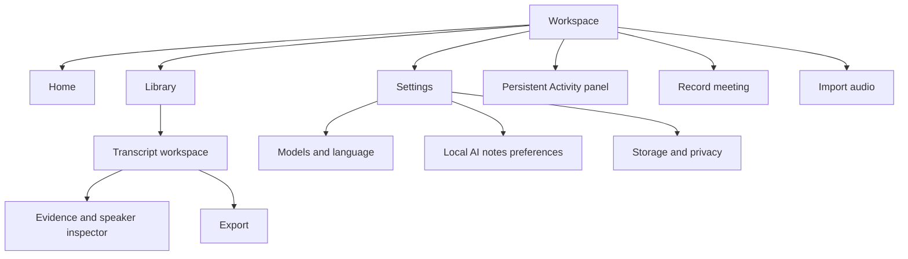

# SilkScribe workspace: product review and improvement plan

Review date: 10 September 2026. This is a review and proposed implementation plan, not a claim that the changes below have shipped.

## Recommendation

Keep the current visual identity and Home / Library / Settings structure. Shift the product from exposing its processing pipeline to helping people complete three jobs confidently: dictate into another app, capture a conversation, and turn existing audio into useful records.

The next release should prioritize trustworthy first use, visible partial success, reliable editing, and recording recovery before adding more AI features. The current implementation is a substantial foundation, but its feature checklist overstates how complete the experience feels to an everyday user.

### Evidence and limits

I reviewed the current workspace, editor, shared controls/player, onboarding, model installer, SQLite storage, queue/checkpoints, local workers, capture bridge, exports, and workspace tests. I reran the five workspace Playwright tests: all passed. I visually inspected the freshly generated Home, transcript, and narrow dark/RTL screenshots.

The prior implementation record reports 80 Rust tests, six worker tests, 29 total Playwright tests, development packaging, and offline speech/notes smoke tests. These broader checks were not all rerun during this review. Browser fixtures substitute the API, contain only two short documents, omit playable audio, return an empty model catalog, and do not simulate recording. They do not establish native capture quality, real model setup, multi-hour performance, or clean-machine readiness. The RTL screenshot uses English under RTL direction; it proves neither Arabic translation nor mixed-script correctness.

Findings below distinguish behavior directly visible in code/screenshots from risks that require targeted reproduction. No real microphone recording, model-quality benchmark, or release signing was performed for this review.

## Design critique

### Anti-pattern verdict

Partial pass. The app avoids decorative gradients, glowing dark surfaces, excessive glass, and a dashboard of invented metrics. The branding, typography, and quiet list treatment are coherent.

The remaining template-like elements are the marketing-sized Home headline, repeated creation actions in both sidebar and large equal-weight cards, redundant privacy copy, and outward arrows on ordinary in-app navigation. These consume attention without helping an established user get back to work. The transcript screen has the opposite issue: it is visually calm but dominated by repeated form controls, with a large speaker dropdown for every short turn.

### What works

- Three primary destinations make the application easy to orient within. Preserve them.
- The library's compact rows and restrained source icons make conversations easier to scan than a card grid.
- Original text, local processing, evidence links, independent audio deletion, and recoverable jobs are strong product commitments. Make their actual status easier to understand.

### Five priority experience issues

1. **Starting work depends on invisible capability gaps.** Replace raw model-first setup with a capability assessment and explicit repair actions. Suggested design workflow: `/onboard` and `/clarify`.
2. **A useful transcript can look like a failed job.** Separate transcript availability from optional speaker/notes status. Suggested workflow: `/harden`.
3. **The transcript is a form rather than a reading workspace.** Make reading the default, with focused editing and persistent transport. Suggested workflow: `/distill` and `/polish`.
4. **Recording communicates activity more clearly than safety.** Show source health, saved-audio state, and recovery paths. Suggested workflow: `/harden` and `/clarify`.
5. **Home and Settings expose implementation structure.** Make Home state-aware and consolidate model ownership under one destination. Suggested workflow: `/normalize` and `/onboard`.

These are recommended implementation workflows, not commands executed in this review.

## Findings grounded in the implementation

Priority definitions: P0 blocks a trustworthy release; P1 materially improves routine use; P2 follows after the core journeys meet their acceptance criteria.

| ID  | Priority | Finding and evidence                                                                                                                                                                                                                                                                                                                                    | User consequence                                                                                                                                                      | Proposed change                                                                                                                                                                                                                                   |
| --- | -------- | ------------------------------------------------------------------------------------------------------------------------------------------------------------------------------------------------------------------------------------------------------------------------------------------------------------------------------------------------------- | --------------------------------------------------------------------------------------------------------------------------------------------------------------------- | ------------------------------------------------------------------------------------------------------------------------------------------------------------------------------------------------------------------------------------------------- |
| F01 | P0       | `DEFAULT_OPTIONS` enables speakers; the Community-1 manifest is unpublished. Setup only warns, and the start button remains enabled. The warning also requires Qwen packs regardless of which ASR model is selected. [Workspace.tsx](../../src/components/workspace/Workspace.tsx:49), [setup logic](../../src/components/workspace/Workspace.tsx:608). | Default jobs can fail at a predictable dependency; native-model users receive irrelevant warnings.                                                                    | One backend capability assessment for the exact requested workflow. Allow recording without models, but label it “Record now, transcribe later.” Never imply unavailable speaker detection will run.                                              |
| F02 | P0       | The queue has a single document `stage`. A diarization failure exits processing before automatic notes, although a transcript may already exist. [pipeline](../../src-tauri/src/workspace/mod.rs:455).                                                                                                                                                  | Optional failure overshadows useful work; the next action is unclear.                                                                                                 | Independent stage outcomes and typed recoveries: “Transcript ready · Speaker labels unavailable,” with Open transcript, Set up speakers, Retry speakers, Generate notes.                                                                          |
| F03 | P0       | `flush()` returns immediately when a save is already in flight. Export, Back, and note generation await it, but that await does not wait for the pending request. [Transcript.tsx](../../src/components/workspace/Transcript.tsx:60).                                                                                                                   | Export can read the previous database text; generation can queue before the last edit is saved. This race is established by control flow; reproduce with delayed IPC. | A real save barrier that resolves only after all queued edits commit. All destructive/dependent commands use it. Add delayed-save, failed-save, and revision-conflict tests.                                                                      |
| F04 | P0       | Drafts are whole documents in `localStorage`; removal is tied to successful mounted saves, not document deletion. [draft storage](../../src/components/workspace/Transcript.tsx:32), [delete](../../src/components/workspace/Transcript.tsx:593).                                                                                                       | Deleted content may remain in a second storage location. A crash during queued saves can leave a draft whose revision no longer matches, silently bypassing recovery. | Central draft ownership, persisted patch/revision history, explicit conflict recovery, and deletion covering drafts, media, checkpoints, and indexes.                                                                                             |
| F05 | P0       | Playback uses the original `audio_path`, while inference uses normalized WAV. The shared player lacks an audio error surface. [player binding](../../src/components/workspace/Transcript.tsx:239), [decoder](../../src-tauri/src/workspace/decode.rs:12).                                                                                               | Import acceptance does not guarantee playback on the target webview. This compatibility risk needs real format tests.                                                 | Track original, capture, and playback assets separately; expose a known-playable asset and recoverable playback errors. Verify codecs inside each advertised container.                                                                           |
| F06 | P0       | Capture status converts an error to a default status, dropping the last duration/pause state. Stop propagates native errors before clearing Rust recording ownership; Swift clears its instance even after a stop failure. [capture.rs](../../src-tauri/src/workspace/capture.rs:89).                                                                   | Faults can show a misleading timer/control state or leave inconsistent ownership. Hardware failure behavior remains untested.                                         | A capture state machine with starting/recording/degraded/paused/finalizing/recovered states, last-known status, idempotent stop, and a distinct finalization error.                                                                               |
| F07 | P1       | Backend emits `workspace-progress`, but Workspace does not subscribe to it; rows display only stage labels. Notes continuations do not report step progress. [Workspace events](../../src/components/workspace/Workspace.tsx:143), [pipeline](../../src-tauri/src/workspace/mod.rs).                                                                    | Long jobs look stalled despite saved progress.                                                                                                                        | A persistent Activity panel with stage, completed audio/steps, last checkpoint, cancellation state, and a reason when waiting for dictation or resources.                                                                                         |
| F08 | P1       | All new packs, including ASR and diarization, are under “Local AI notes,” while “Models & language” opens the legacy model screen. Backend errors point to the latter. [settings](../../src/components/workspace/Workspace.tsx:654), [packs.rs](../../src-tauri/src/workspace/packs.rs:62).                                                             | Users go to the wrong settings page to repair a failure.                                                                                                              | One Models & language manager for capability packs and advanced artifacts. Local AI notes holds note defaults and review preferences. Deep-link repairs to the exact missing capability.                                                          |
| F09 | P1       | Language choices are a fixed list matching the aligner's narrower set, shared by all ASR choices. Qwen can switch to Whisper at runtime without a preflight guarantee that it is installed. [language list](../../src/components/workspace/Workspace.tsx:56), [fallback](../../src-tauri/src/workspace/mod.rs:326).                                     | Broader Whisper language coverage is difficult to discover; automatic detection can trigger a late dependency failure.                                                | A model/language capability matrix; distinguish ASR and alignment support. Explain and prepare an allowed fallback before processing, and report the actual model used.                                                                           |
| F10 | P1       | Every segment is a textarea plus speaker control. Playback updates the parent on animation frames; the parent filters and renders all segments on each update. [Transcript.tsx](../../src/components/workspace/Transcript.tsx:152), [AudioPlayer.tsx](../../src/components/ui/AudioPlayer.tsx:65).                                                      | Long transcripts may become expensive to render; reading and listening are unnecessarily control-heavy. This needs a realistic performance benchmark.                 | Read mode, focused edit mode, isolated transport state, active-segment updates only when the segment changes, and accessible windowing/pagination for long documents.                                                                             |
| F11 | P1       | Source links switch tabs and scroll; search filters away surrounding context. Merges take effect immediately and have no explicit preview/undo. [editor](../../src/components/workspace/Transcript.tsx:119).                                                                                                                                            | Users lose their place while checking a claim or correcting a speaker.                                                                                                | Evidence inspector with a short excerpt and playback; return-to-note navigation; find next/previous with result count; speaker samples and a reversible merge operation.                                                                          |
| F12 | P1       | UI speaker and note controls remain editable during some active stages, while Store rejects all active-document edits. [speaker/notes UI](../../src/components/workspace/Transcript.tsx:377), [Store::edit](../../src-tauri/src/workspace/store.rs:156).                                                                                                | Controls invite changes that cannot save.                                                                                                                             | Derive edit permissions from one document capability object. Initially lock consistently with a reason; later support immutable processing snapshots plus independent user revisions.                                                             |
| F13 | P1       | Notes validation checks shape and whether source IDs exist, using the entire transcript's ID set for each chunk. [worker.py](../../src-tauri/workers/worker.py:20).                                                                                                                                                                                     | Valid references do not establish factual support; a chunk can cite an ID it never received.                                                                          | Restrict citations to each step's evidence set, retain quoted evidence spans, validate consolidation citations against inputs, and visibly distinguish generated from reviewed notes. Never portray source-ID validation as factual verification. |
| F14 | P1       | JSON exports the internal Document, including absolute audio paths and processing fields. SRT/VTT remain selectable for legacy dictation but fail after destination selection. [export.rs](../../src-tauri/src/workspace/export.rs:24).                                                                                                                 | A sharing format exposes local implementation details; users discover format restrictions late.                                                                       | Versioned public export schema without local paths by default; separate diagnostic export; capability-aware export sheet with preview, content choices, and stale-note disclosure.                                                                |
| F15 | P1       | File selection replaces the batch; import is a blocking copy operation per file with transient error toasts. No persistent per-file validation or total-space preview. [selection](../../src/components/workspace/Workspace.tsx:259), [import](../../src-tauri/src/workspace/mod.rs:92).                                                                | Large batches are hard to correct and failures are hard to revisit.                                                                                                   | Append/deduplicate/remove selection, per-file validation, aggregate duration/space estimate, persistent result summary, and progress/cancellation during managed copying.                                                                         |
| F16 | P1       | List/search returns entire JSON documents, scans segment JSON, and synchronizes legacy history on each list request. Queue selection and restart recovery are capped at the newest 10,000 documents. [store.rs](../../src-tauri/src/workspace/store.rs:59), [queue](../../src-tauri/src/workspace/mod.rs:217).                                          | Costs grow with both library and transcript size; older eligible jobs can be missed. SQLite's default `lower()` also needs multilingual-search verification.          | Lightweight list DTOs, indexed stage queries without an arbitrary discovery cap, FTS with explicit Unicode behavior, stable pagination, and event-driven legacy synchronization.                                                                  |
| F17 | P1       | Narrow CSS hides all row status text; transcript tabs lack the full roving-focus/panel relationship, and the shared playback slider has no accessible name. [CSS](../../src/components/workspace/workspace.css:844), [tabs](../../src/components/workspace/Transcript.tsx:269), [player](../../src/components/ui/AudioPlayer.tsx).                      | Important state disappears at small widths; keyboard and screen-reader operation is incomplete.                                                                       | Preserve status beneath titles, label transport controls, complete tab keyboard behavior, move focus on navigation, and test actual translated RTL content.                                                                                       |
| F18 | P1       | Home uses a static dictation setup sentence, repeated action cards, and repeated privacy reassurance. [Home](../../src/components/workspace/Workspace.tsx:791).                                                                                                                                                                                         | Existing users see onboarding copy instead of readiness, their shortcut, or pending work.                                                                             | A state-aware Home: first-use guidance initially; recording/activity, needs-attention items, actual dictation readiness, and recents thereafter.                                                                                                  |
| F19 | P1       | Model packs have estimates but no measured-memory admission, installed-pack removal/repair UI, or download pause/cancel. The ready check tests executable presence. [packs.rs](../../src-tauri/src/workspace/packs.rs), [commands.rs](../../src-tauri/src/workspace/commands.rs).                                                                       | Users cannot confidently manage multi-gigabyte local dependencies or distinguish installed from runnable.                                                             | Show disk use, compatibility, verification/health, cancellable resumable downloads, repair/remove, benchmark provenance, and a memory assessment for the selected model. Never silently substitute a smaller model.                               |

## Proposed product structure

Activity is a persistent utility, not a fourth top-level destination. Keep saved transcripts as a Library filter. Do not introduce projects, teams, bots, cloud sync, or cross-recording voice recognition in this cycle.

### Home

**New installation:** a short introduction and three workflow choices: Dictate, Record a meeting, Import audio. Choosing a workflow determines subsequent setup. Avoid demanding all permissions or downloading every model up front.

**Daily use:** replace the marketing headline with “Home” and useful state. Place active recording first, followed by actionable unfinished work, actual dictation readiness/shortcut, and recents. Keep Record meeting and Import audio in the persistent navigation; use the large introduction cards only for first use or an empty workspace.

A failed speaker step should read “Transcript ready · Set up speaker labels,” not just “Needs attention.” Recents should show speaker count, duration, date, and whether notes are available. Usage statistics can remain optional and secondary.

### Creation and model setup

Offer workflow presets such as “Fast transcript,” “Detailed transcript,” and “Transcript + notes.” These are explicit saved configurations, not promises of universal quality. Initially recommend only combinations validated on the current platform and language. Keep exact model names, languages, artifact revisions, and override controls in Advanced.

Before submission, present an executable plan: inputs, audio sources, transcription model, timing capability, optional speaker/notes steps, required downloads, disk needs, and any unvalidated capability. Do not use a blanket Qwen dependency test for all models.

If recording can proceed but processing cannot, offer “Record now, transcribe later” with clear state. If speakers are unavailable, offer an explicit “Continue without speaker labels” choice and preserve the user's intended speaker step as pending setup. Do not silently change their choice or fail a predictable optional stage after transcription.

When navigating to setup, preserve selected files, title, language, and options. After installation, return to the pending workflow. Save defaults separately for meetings and imports; a one-off override should not unexpectedly change dictation.

### Meeting recording

Provide a compact source check before starting: selected microphone, computer-audio source, permission state, disk headroom, and a test meter activated when permission is requested. Do not require accessibility permission for meetings or files.

During capture, show title, elapsed recorded duration, per-source health, pause state, and “Audio saved locally” only when the implementation can substantiate it. A disconnected computer-audio source must remain visible even if the microphone continues. Never replace the last known duration with zero on error.

Stop should transition through “Finishing audio” to either “Recording saved; processing queued” or “Recording saved; repair required.” Provide capture-only Stop & save as well as Stop & transcribe. Make quit, sleep, device loss, and failed finalization explicit state-machine transitions. Recovery should offer a preview of recoverable duration before queueing.

### Imports and activity

The import screen should behave like a batch manifest: filename, actual codec/container, duration, size, readiness, duplicate detection, remove, and optional title. Adding files appends. Validation errors remain in the manifest rather than disappearing in toasts.

Activity should expose completed and pending stages independently, with progress appropriate to the stage: bytes copied, audio duration processed, note chunks completed, or indeterminate work with a truthful explanation. Only show ETA once measurements support it. Display “Waiting for dictation” and “Cancelling after current native inference” when applicable.

Actions: Cancel processing, Resume, Retry failed stage, Change processing options, Set up missing model, and Open transcript as soon as text exists. Add queue reordering after scheduling correctness is established. Failure of notes must not stop reading, playback, or transcript export.

### Transcript workspace

Use a document-oriented header: editable title, date/duration/source, processing status, and a compact export/action menu. Keep transport sticky within the workspace.

Default to a readable transcript with a subdued time gutter and speaker label. Enter editing on click or keyboard command; show formatting/control affordances on focus. Keep original text accessible as a comparison and restore action. Add an explicit edit history/undo boundary for speaker merges and bulk corrections.

Find should highlight matches with count and next/previous navigation while retaining context. Offer an optional “Show matching turns only” mode. Add a Follow playback toggle and prevent automatic scroll while the user edits or reads elsewhere. Use real alignment capability to determine word highlighting; do not synthesize it for segment-only models.

At wide widths, allow Notes beside Transcript with an evidence inspector. At narrower widths, use a single view and a return-to-note breadcrumb. Evidence links should show a supporting excerpt and seek without erasing the user's search or previous scroll position.

Speaker management: listen to a short sample, rename, assign a turn, select several turns, merge with preview, and undo. Preserve the difference between original diarization, overlapping turns, and corrected display assignments. Add new/manual speaker identity within a recording; never imply cross-recording recognition.

Notes: distinguish Not generated, Generating, Generated, Reviewed, Outdated, and Failed. Allow adding/removing user-written items, reviewing evidence, and regenerating a selected section. Preserve manual edits through a previewable regeneration result rather than replacing the notes document in place. Leave unsupported owners/dates blank and retain relative dates verbatim unless anchored to known recording metadata.

### Settings, privacy, and export

Keep six clear groups: Dictation; Audio; Models & language; Local AI notes; Appearance & language; Storage & privacy. Put advanced diagnostics beneath progressive disclosure rather than adding more equal-weight tabs.

Models & language owns every engine/capability. Local AI notes owns the selected note model, automatic generation default, output language/style, and review behavior. Distinguish the existing optional network-based dictation post-processing settings from the strictly local new workspace pipeline; scope privacy claims accordingly.

Storage should show real use by recordings, originals, playback assets, models, checkpoints, and drafts. Explain what audio deletion removes and what text remains. Provide model repair/removal and export-before-delete. Avoid promising secure erasure from backups or SSD storage.

Use an export sheet with format, included sections, speaker labels, timestamp precision, filename preview, and a sample. Disable unsupported subtitle formats before the save dialog. Default JSON should be a stable, documented exchange format without local paths; diagnostics should be a separate explicit choice.

## Implementation plan

Sequence by dependency, with completion gates rather than a fixed calendar promise. Effort sizes are relative: S is a focused change, M spans one workflow, L changes multiple layers, XL requires native/runtime and benchmark work.

### Phase 1 — Trust and readiness (P0, L)

**Deliverables**

- Add `assess_workflow` returning platform/permission/runtime/model/language/disk readiness plus typed issues and available next actions.
- Create separate transcript availability and per-stage job status. Typed error codes carry stage, retryability, dependency, and repair target; localized UI owns presentation.
- Replace autosave's early-return function with a shared in-flight promise and drainable mutation queue. Make export, regeneration, navigation, and deletion await the save barrier.
- Move drafts into managed persistence or introduce a centralized draft repository with revision-safe recovery and deletion. Add a dirty/save-conflict surface.
- Correct capture error/stop ownership and make finalization idempotent. Keep recording independent from model readiness.
- Expose a verified playback asset and playback failure actions.

**Acceptance gate**

- A clean install can import without microphone/accessibility permission.
- Native-only transcription is not blocked by missing Qwen or notes runtime.
- Missing Community-1 produces a clear decision before processing; available transcript text remains accessible after optional failure.
- Under delayed/failing saves, export/generation uses the last committed user edit or is explicitly blocked. No edit is silently discarded on close/reopen.
- Deleting a document removes its managed drafts and checkpoints as well as database/media records.
- Stop failure cannot leave the UI falsely recording or discard access to recovery tracks.
- Each advertised audio format has successful native decode and webview playback tests.

### Phase 2 — Activity and creation flows (P1, L)

**Deliverables**

- Subscribe to and reconcile progress events using job IDs, step IDs, and monotonic event versions. Recover state from SQLite after missed events or restart.
- Add the Activity panel and independent stage actions, including retry with changed options and skip optional enhancement.
- Persist meeting/import setup drafts. Implement append/deduplicate batch selection, preflight rows, managed-copy progress and cancellation.
- Add named workflow presets and a consolidated model setup destination with a return path to the pending task.
- Make Home switch between first-use and daily-use layouts.

**Acceptance gate**

- A ten-file batch can contain one unsupported and one missing file without losing the other selections.
- Restart at every checkpoint resumes exactly once, without duplicated transcript turns or repeated completed note steps.
- A queued/failed/completed-with-warning job has an obvious next action at wide and narrow window sizes.
- Downloading the exact missing pack returns users to their saved setup.
- Progress is visible without reopening a document and never displays a fabricated completion percentage.

### Phase 3 — Transcript review and evidence (P1, L)

**Deliverables**

- Read/edit modes, sticky transport, focus-safe save states, find navigation, follow-playback control, and accessible large-document rendering.
- Speaker sample playback, manual speaker creation, multi-turn assignment, explicit merge command and undo.
- Evidence inspector and user review state for generated notes; add/remove items and non-destructive section regeneration.
- Versioned export DTOs, preview, format capability checks, original/edited selection and stale-note handling.

**Acceptance gate**

- Reviewers can find a phrase, hear its context, correct it, inspect the related note, and return to their original position using the keyboard.
- A four-hour transcript remains responsive while playing and editing. Proposed performance targets: visible keystroke response under 100 ms p95 and no recurring main-thread tasks over 50 ms during playback on the reference Mac; verify with traces.
- A speaker merge is reversible and exports preserve corrected exclusive assignments and original overlap provenance.
- Regeneration never silently overwrites a manually edited note.
- JSON excludes local file paths by default; subtitles preserve actual timestamp precision and validate in an independent parser.

### Phase 4 — Storage, scheduling, and model operations (P1, XL)

**Deliverables**

- Lightweight `DocumentSummary` list results; indexed job selection; FTS and multilingual-search tests; pagination stable during updates.
- Separate transcript revision, note revision, and processing snapshot IDs. Preserve immutable timed/word data instead of deriving all output from coalesced editable turns.
- Model download lifecycle with cancel/resume, verify, repair, uninstall, disk accounting, and recovery from a interrupted atomic swap.
- Record exact model/runtime revisions and measured peak memory for reference fixtures. Add current headroom assessment and a deliberate user choice if the chosen model does not fit.
- Profile dictation wait time, worker startup, model load/unload cost, and throughput. Define an explicit scheduling contract for background stages.
- Investigate Community-1 yielding only after the full offline bundle is available. Prefer a supported resumable internal-stage approach; preserve recording-wide clustering. Do not split diarization into independent chunks with independently numbered speakers.

**Acceptance gate**

- Queue discovery/recovery works beyond 10,000 library documents.
- Search has documented behavior for case, accents, CJK and Arabic, with a representative corpus and p95 latency measurements.
- A paused/cancelled download resumes safely; corrupt weights cannot become “Ready”; users can remove installed packs and reclaim their measured space.
- Published model recommendations name artifact revision, runtime, hardware, context/fixture, and measurement method. Estimates remain labeled estimates.
- Dictation latency and background throughput meet documented measured targets; the app explains any non-preemptible operation.

### Phase 5 — Accessibility, localization, and visual refinement (P1/P2, M–L)

**Deliverables**

- Full tab semantics/keyboard behavior, named transport slider, contextual screen-reader labels, focus restoration, visible focus, and reduced-motion behavior.
- Localized new workspace copy and errors, actual Arabic RTL fixtures, long translations, mixed-script titles and filenames, and locale-aware search tests.
- Reduce Home headline and duplicate cards after onboarding; replace outward navigation arrows with appropriate chevrons; retain the current brand palette and Manrope.
- Preserve job state at narrow widths. Use readable bounded text columns, sticky transport, restrained speaker labels, and consistent shared controls.

**Acceptance gate**

- Complete import → transcript → evidence → export using only the keyboard and with VoiceOver.
- At the supported minimum window width, recording stop/pause, job status, and repair actions remain visible and reachable.
- 200% zoom/text enlargement and long localized labels do not clip essential content.
- No missing workspace translation keys in supported locales. RTL acceptance uses real translated text, not only `dir=rtl` on English.
- Contrast is measured for primary/secondary text, disabled controls, timestamps, focus indicators, and both themes.

### Phase 6 — Release validation (P0 release gate, XL; external dependencies)

- Publish and test Community-1's complete offline bundle and attribution/manifest.
- Establish annotated audio fixtures for accents, mixed languages, silence, overlap, and loudspeaker echo. Measure ASR error, diarization error, alignment error, note factual support, runtime, and peak memory for exact artifacts.
- Compare approved quantizations against upstream outputs. Keep 27B recommendations provisional until tested.
- Run clean-install and network-denied tests through the actual app bundle, not just standalone workers.
- Exercise denied/revoked permissions, unplugged devices, sleep/wake, full disk during capture/copy/checkpoint/finalization, worker crashes, cancel/retry, and concurrent dictation.
- Complete Developer ID signing/notarization and clean-machine launch checks; verify the preserved Intel/Windows/Linux dictation paths separately.

**Release gate:** do not advertise premium meeting transcription as complete until capture reliability, exact shipped artifacts, supported formats, and offline packaged operation meet the published matrix. Passing unit/browser fixtures alone is insufficient.

## Proposed interfaces and data boundaries

| Boundary            | Proposed shape / responsibility                                                                                                                                                                     |
| ------------------- | --------------------------------------------------------------------------------------------------------------------------------------------------------------------------------------------------- |
| Workflow assessment | `WorkflowAssessment { canCapture, canProcess, capabilities, requiredDownloads, diskRequirement, issues, actions }`; notes memory measurements include provenance.                                   |
| Document summary    | ID, title, source, created time, duration, speaker count, saved flag, transcript availability, note state, activity summary. No full segment text in list responses.                                |
| Job/stage           | Durable stage records: state, dependency, progress unit, completed units, checkpoint, error code, retry policy, snapshot ID. UI subscribes to a versioned event stream and reconciles from storage. |
| Transcript          | Original immutable timed segments/words, user edits, corrected speaker assignments, and a transcript revision independent of metadata or notes.                                                     |
| Notes               | Generated result + model provenance + evidence spans + source transcript revision + user edits + review state. Regeneration produces a candidate revision.                                          |
| Media               | Original import, synchronized source tracks, normalized inference/playback asset, size/duration/codec and deletion state.                                                                           |
| Export              | Stable public schema; separate diagnostics payload with an explicit preview and exclusion controls.                                                                                                 |

Migrate additively with tested rollback/recovery paths. Preserve existing history IDs, saved state, original text, audio ownership, and dictation retention. Do not rewrite the entire application to introduce these boundaries.

## Measurement and evaluation

Use local diagnostics and consented testing; do not add hosted telemetry or upload transcripts to measure these outcomes.

- First successful workflow: users can distinguish readiness from missing setup and complete their chosen workflow without an unrelated permission prompt.
- Time to a usable transcript: distinguish capture/import duration, waiting, model loading, inference, and optional enrichment.
- Recovery success: interruption tests resume without lost audio, duplicate turns, or dropped edits.
- Review effort: time to find and correct a specified phrase/speaker and verify a note against audio.
- Trust: users can explain where processing happens, which source produced an item, and what is deleted.
- Performance: cold/warm startup, search latency, editing latency, playback responsiveness, dictation wait, peak memory, disk amplification.

Suggested first research round: five to eight participants spanning frequent dictation users, meeting-heavy professionals, and people importing interviews/lectures. Treat this as a discovery sample, not statistically conclusive validation. Include a new installation, unavailable optional model, interrupted import, ambiguous speaker assignment, and a note with unsupported ownership. Let these sessions inform defaults before expanding features.

## What to defer

Defer chat-with-transcript, automatic folders/tags, calendar integrations, meeting bots, live captions, cross-recording voice recognition, team workspaces, and hosted inference. None is needed to resolve the current friction. Optional manual collections/tags can follow once search, saved state, and library scale are proven.

The next concrete implementation milestone should be Phase 1: capability-aware setup, independent partial-success states, and a reliable save/delete boundary. It improves the core product more than another visual overhaul or another model choice.
